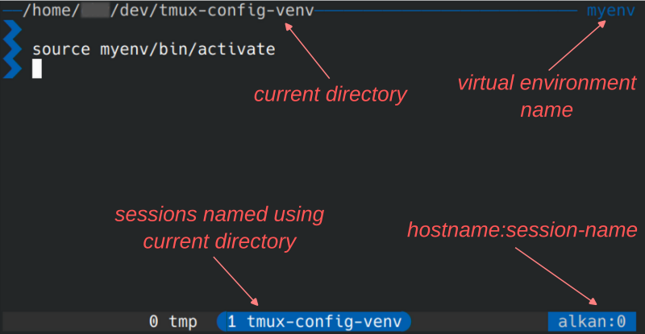

# tmux

A *tmux* config tailored for use in code editing software such as *VS Code* or *zEdit*.

This *tmux* config provides:
* a short prompt, made of an arrow, to use as little horizontal space as possible in narrow terminal windows,
* the current directory at the top of the view,
* dynamic session names using the current working directory,
* compatibility with virtual environments (with the name of the loaded virtual environment in the top right corner),
* no unnecessary clutter, such as time or date.



## Install

1. Copy the [tmux.conf](tmux.conf) file into `~/.config/tmux/tmux.conf`
2. Copy and paste (or source) [bash_prompt.sh](bash_prompt.sh) into your `~/.bashrc`

  The `build_prompt` function creates the variables `TMUX_WORKDIR` (the current working directory, specific to each tmux window) and `TMUX_VENV` (the virtual environment name) that tmux places in the top status bar.

## Editor config

### VS Code

Open the `settings.json` file by following these [instructions](https://code.visualstudio.com/docs/configure/settings#_settings-json-file). The most convenient way is to execute **>Preferences: Open User Settings (JSON)** in the Command Palette (`Ctrl+Shift+P`).

```json
"terminal.integrated.profiles.linux": {
    "tmux": {
        "path": "bash",
        "args": ["-c", "tmux new -ADs V·${workspaceFolderBasename}"],
        "icon": "terminal-tmux",
    },
},
"terminal.integrated.defaultProfile.linux": "tmux",
```

> [!NOTE]
> The `-ADs` tmux arguments create a new session named `V·[`*`your workspace folder basename`*`]` if it doesn't exist, *and open it if it already exists*. This ensures that a new session isn't created each time the editor window is reopened or reloaded, but the same tmux session is reopened.
